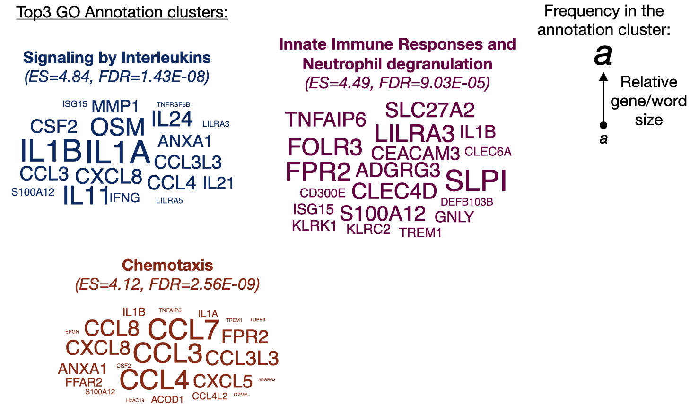

```{r setup, include=FALSE}
knitr::opts_chunk$set(echo = TRUE)
```

# 1) Load required packages, color palette and gg theme
```{r, Load packages and set gg theme, warning=FALSE, message=FALSE}
library(tm) # for text  mining
library(ggwordcloud) # for plotting the wordcloud
library(tidyverse)

library(jcolors)
pal9 <- jcolors("pal9")
theme_set(theme_minimal())
```

# 2) AC1 - Import the members (genes) and text mining
```{r, 2) import AC, warning=FALSE}
term1 <- "Signaling by Interleukins"

## Load the text:
AC1 <- readLines("import_export/annotation_cluster1")
AC1
AC1 <- Corpus(VectorSource(AC1)) # Load the data as a corpus (a modified list)
inspect(AC1)

## Text transformation:
#toSpace <- content_transformer(function (x , pattern ) gsub(pattern, " ", x))

#AC1 <- tm_map(AC1, toSpace, "/")
AC1 <- tm_map(AC1, removePunctuation) # Remove punctuation
inspect(AC1)

## Build a term-document matrix and model frequency data
AC1 <- TermDocumentMatrix(AC1) # Calculates sparsity and word frequencies
inspect(AC1)
AC1 <- as.matrix(AC1)
rownames(AC1) <- str_to_upper(rownames(AC1)) # convert back to capital
AC1 <- sort(rowSums(AC1),decreasing=TRUE)
AC1 <- data.frame(word = names(AC1),freq=AC1) # new modeled data
AC1$freq <- as.numeric(AC1$freq)
AC1 <- arrange(AC1, desc(freq))
AC1$word <- as.factor(AC1$word)
AC1
```

# 3) AC1 - plotting
```{r, AC1 plotting, warning=FALSE, message=FALSE}
AC1 %>%
  ggplot(., aes(x=fct_inorder(word), y=freq)) +
  geom_bar(stat = "identity") +
  theme(axis.text.x = element_text(angle = 90, hjust = 1, vjust = 0.5)) +
  ggtitle("Frequency in which the gene was annotated to a geneset in AC1")

AC1_plot <- AC1 %>%
  add_column(Gene = "yes") %>% 
  ggplot(., aes(label = word, size = freq, color=Gene)) +
  scale_radius(range = c(1, 10), limits = c(0, NA)) +
  geom_text_wordcloud(area_corr = TRUE) +
  scale_size_area(max_size = 24) +
  scale_color_manual(values = pal9[1]) +
  ggtitle(term1) +theme(plot.title = element_text(hjust = 0.5, color = pal9[1]))
AC1_plot
```

# 4) AC2 and AC3
```{r, import AC2 and AC3, warning=FALSE, message=FALSE}
# AC2
term2 <- "Innate immune responses and Neutrophil degranulation"
AC2 <- readLines("import_export/annotation_cluster2")
AC2 <- Corpus(VectorSource(AC2))
AC2 <- tm_map(AC2, removePunctuation)
AC2 <- TermDocumentMatrix(AC2) #from tm
AC2 <- as.matrix(AC2)
rownames(AC2) <- str_to_upper(rownames(AC2))
AC2 <- sort(rowSums(AC2),decreasing=TRUE)
AC2 <- data.frame(word = names(AC2),freq=AC2)
AC2$freq <- as.numeric(AC2$freq)
AC2 <- arrange(AC2, desc(freq))
AC2$word <- as.factor(AC2$word)
AC2_plot <- AC2 %>%
  add_column(Gene = "yes") %>% 
  ggplot(., aes(label = word, size = freq, color=Gene)) +
  scale_radius(range = c(1, 10), limits = c(0, NA)) +
  geom_text_wordcloud(area_corr = TRUE) +
  scale_size_area(max_size = 24) +
  scale_color_manual(values = pal9[2]) +
  ggtitle(term2) +theme(plot.title = element_text(hjust = 0.5, color = pal9[2]))

# AC3:
term3 <- "Chemotaxis"
AC3 <- readLines("import_export/annotation_cluster3")
AC3 <- Corpus(VectorSource(AC3))
AC3 <- tm_map(AC3, removePunctuation)
AC3 <- TermDocumentMatrix(AC3) #from tm
AC3 <- as.matrix(AC3)
rownames(AC3) <- str_to_upper(rownames(AC3))
AC3 <- sort(rowSums(AC3),decreasing=TRUE)
AC3 <- data.frame(word = names(AC3),freq=AC3)
AC3$freq <- as.numeric(AC3$freq)
AC3 <- arrange(AC3, desc(freq))
AC3$word <- as.factor(AC3$word)
AC3_plot <- AC3 %>%
  add_column(Gene = "yes") %>% 
  ggplot(., aes(label = word, size = freq, color=Gene)) +
  scale_radius(range = c(1, 10), limits = c(0, NA)) +
  geom_text_wordcloud(area_corr = TRUE) +
  scale_size_area(max_size = 24) +
  scale_color_manual(values = pal9[3]) +
  ggtitle(term3) +theme(plot.title = element_text(hjust = 0.5, color = pal9[3]))
```

# 7) Proposed final image
{width=50%}  
  
  
# 8) Highlight specific genes of interest
```{r, highlighting, warning=FALSE, message=FALSE}
AC1 %>%
  add_column(Gene = "yes") %>%
  mutate(IL1_cytokines = case_when(
    word %in% c("IL1A", "IL1B") ~ "biomarker",
    TRUE ~ "not_biomarker")) %>%
  ggplot(., aes(label = word, size = freq, color=IL1_cytokines)) +
  scale_radius(range = c(1, 10), limits = c(0, NA)) +
  geom_text_wordcloud(area_corr = TRUE) +
  scale_size_area(max_size = 24) +
  scale_color_manual(values = c(pal9[4],pal9[6])) +
  ggtitle(term1) + theme(plot.title = element_text(hjust = 0.5))
```

# Session Info
**Session Info:**
```{r sessionInfo, results='asis', message=FALSE, warning=FALSE, echo=FALSE}
sessionInfo()
```
